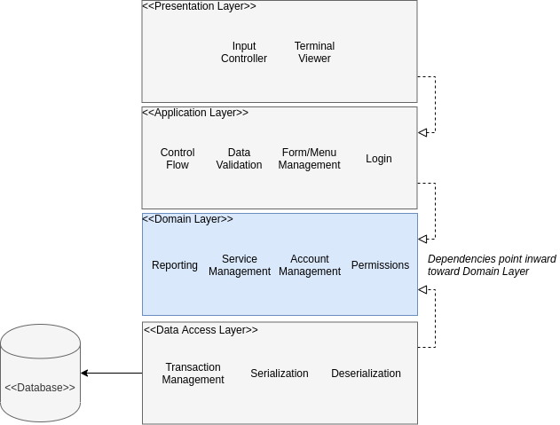

# Contributing Guide

A lot of architecture code was recently added to this project. As such, I recognize that the codebase may seem foreign or even intimidating. For this reason, I am writing this contributing guide in order to enlighten contributors about how to write code 
within the current framework. Hopefully this will also illuminate the purposes and benefits of the current architecture decisions. 

## Design Overview

Firstly, the ChocAn application is designed with a layered system architecture. 



On the bottom we have the **Data Access Layer** which is responsible for communicating with the databse to retrieve/update ChocAn records.
Next is the **Domain Layer**, this layer describes all the business logic for the application, and defines how entities interact with each other.
You'll find the Member/Provider classes and other entities in this layer. Connected to the **Domain Layer** is the **Application Layer**. 
The **Application Layer** manages the control flow of the actual application, and communicates with the **Domain Layer** to validate input and 
perform other actions. Lastly is the **Presentation Layer**, this layer is where all the IO actually happens. Reading input from the user, printing and 
formatting state representation, all occurs here. In fact, the only place where *iostream* should be included in a source file is within the **Presentation Layer**. This guide will deal mostly with the **Application** and **Presentation** layer.

## Application Layer

The **Application Layer** uses a [finite-state machine](https://en.wikipedia.org/wiki/Finite-state_machine) to model user interaction with the application. Essentially, as we interact with the application the behavior of the application changes. For example, when I start up the application I am greeted with a login screen, if I enter the correct login I can transition to a provider menu screen. However, the set of actions I can take are different at the menu screen than the login screen. Using a state machine and implementing the [state pattern](https://en.wikipedia.org/wiki/State_pattern) allows our application to exhibit different behavior depending on the internal state. We accomplish in code by leveraging a variant and the visitor pattern. Lets look first at the `State_Controller`

```c++
// File: include/ChocAn/app/state_controller.hpp

class State_Controller
{
public:

    State_Controller( ChocAn_Ptr        chocan
                    , State_Viewer_Ptr  state_viewer
                    , Input_Control_Ptr input_controller
                    , Application_State initial_state = Login());

    // Renders state view, and calls transition
    State_Controller& interact();

    // Transition to next state through visitor pattern
    State_Controller& transition();

    const Application_State& current_state() const;

    bool end_state() const;

    /** Visitor Methods **/
    Application_State operator()(const Login&);
    Application_State operator()(const Exit&);
    Application_State operator()(const Provider_Menu&);
    Application_State operator()(const Manager_Menu&);
    Application_State operator()(Add_Transaction&);
    Application_State operator()(const Confirm_Transaction&);

private:

    /* Member Variables */
};

```

The `State Controller` is the main workhorse of the application. It uses the `chocan` API, a `state_viewer`, and `input_controller` to create an interactive experience for the user. If you notice, the function call operator() is overloaded to accept different kinds of `Application_State`. Let's look at the definition of `Application_State`.

```c++

// File: include/ChocAn/app/application_state.hpp

using Application_State = std::variant< Login
                                      , Exit
                                      , Provider_Menu
                                      , Manager_Menu
                                      , Add_Transaction
                                      , Confirm_Transaction
                                      >;

```

That's the entire definition! A variant, sometimes called a [tagged_union](https://en.wikipedia.org/wiki/Tagged_union), is a sum type that allows this structure to hold a value that can only be one of any of the tagged types. 

## Making New States and State Views

Now that we understand the basic design of the application layer, lets add a new state! As per the requirement [use cases](https://github.com/AlexanderJDupree/ChocAn/projects/12) we want the provider and manager to be able to view member and provider accounts. As such, we will need a `View_Account` Application state to model this activity in the application. 

First, lets create a new branch where our work will go. 

```bash
git checkout -b view_account
```

Then, we need to create the `View_Account` class and add it to the `Application_State` variant. I will also add an `Account` object as a member variable for the `View_Account` class, because we will need that resource to display the `Account` information. In the file `include/ChocAn/app/application_state.hpp` add the following:

```c++

// File: include/ChocAn/app/application_state.hpp

// Need this include for the Account definition
#include <ChocAn/core/entities/account.hpp>

/** Other Classes **/

class View_Account
{
public:
    Account account;
};

using Application_State = std::variant< Login
                                      , Exit
                                      , Provider_Menu
                                      , Manager_Menu
                                      , Add_Transaction
                                      , Confirm_Transaction
                                      , View_Account // <-- Add this line to the variant
                                      >;

```

Basically what we've done as created a new class with an `Account` dependency and said that the `Application_State` can now be of this type as well. Now we need to define the logic for this activity in the `State_Controller`. In the file `include/ChocAn/app/state_controller.hpp`  we will need to add the function signature for the `View_Account` overload

```c++
// File: include/ChocAn/app/state_controller.hpp

    /** Visitor Methods **/
    Application_State operator()(const Login&);
    Application_State operator()(const Exit&);
    Application_State operator()(const Provider_Menu&);
    Application_State operator()(const Manager_Menu&);
    Application_State operator()(const Add_Transaction&);
    Application_State operator()(const Confirm_Transaction&);
    Application_State operator()(const View_Account&); //<-- Add this overloaded function

```

Now in the `src/app/state_controller.cpp` file we can define the behavior for this state. For now we will keep it simple, and just wait for the user to press 'Enter' before returning back to the `Provider_Menu`. In the future, we want to have the `View_Account` state to return to the previous state, which could either be a `Provider_Menu` or the `Manager_Menu`, however we will keep it simple for now. To do this we add the following to the `.cpp` file:

```c++

Application_State State_Controller::operator()(const View_Account& state)
{
    input_controller->read_input();
    return Provider_Menu();
}

```

Next lets define a view for this state! We want the view to format the `Account` information and present it in a uniform way. To accomplish this we need to first create the view:

```bash
touch views/'View Account.txt'
```

The name of the view file is also very important. It MUST match the `state_name` field that we define in the resource loader. I'll get to that in a bit. First, lets populate the view file with the `Account` information and viewer commands. You can do it like this:

```
<header>

ChocAn ID: <@account.id> | <@account.type>

Name: <@account.name.last>, <@account.name.first>

Address: <@account.address.street>
         <@account.address.city> <@account.address.state>, <@account.address.zip>

Press 'Enter' to continue:
<prompt>
```

There's a few things going on here. First, text within the '<>' characters are viewer commands. They tell the `Terminal_State_Viewer` to perform text substitution. The commands with the '@' references a resource in memory, like the `Account` object. This design allows our views to be dynamic, and highly customizable. However, if we tried to build and run the application right now, this wouldn't work. First, we haven't created a path to get to the `View_Account` state;  and second we haven't defined yet how the `Resource_Loader` serializes the data into a resource table for the `Terminal_State_Viewer`. Lets handle the serialization first. 

## Data Serialization with the Resource_Loader

Right now we have to manually describe how to serialize the data into a format that the `Terminal_State_Viewer` can utilize. However, I plan on automating this process in the future by adding metadata to each object such that a Serializer class can automatically access required information by examining the components of an object. But, for now we need to do it manually. First lets take a look at the `include/ChocAn/view/resource_loader.hpp` header file. 

```c++
struct Resource_Loader
{
    using Resource_Table = Terminal_State_Viewer::Resource_Table;

    Resource_Table operator()(const Exit&);
    Resource_Table operator()(const Login& login);
    Resource_Table operator()(const Provider_Menu& menu);
    Resource_Table operator()(const Manager_Menu& menu);
    Resource_Table operator()(const Add_Transaction& transaction);
    Resource_Table operator()(const Confirm_Transaction& state);
};
```
The `Resource Loader` is a functor just like the `State_Controller` and needs to overload the function call operator for each state. So, just like the `State_Controller` lets add our state and define what we do. Add this line to the `.hpp` file:

```c++
Resource_Table operator()(const View_Account& state);
```

The `Resource_Table` is a tree that maps strings to functions that returns strings. I.E. the `key` is a string like `@account.id` and it returns an anonymous function that retrieves that data for us. So we need to define a key-value pair for each resource we want to include in the table. To do this, open the file `src/view/resource_loader.cpp` and add the following lines:

```c++
// File: src/view/resource_loader.cpp

Resource_Loader::Resource_Table Resource_Loader::operator()(const View_Account& state)
{
    return
    {
        { "state_name",   [&](){ return "View Account"; } },
        { "account.id",   [&](){ return std::to_string(state.account.id()); } },
        { "account.type", [&]()
            { 
                return std::visit( overloaded {
                    [](const Member&)   { return  "Member"; },
                    [](const Manager&)  { return "Manager"; },
                    [](const Provider&) { return  "Provider"; }
                }, state.account.type() );
            } },
        { "account.name.last",  [&](){ return state.account.name().last();  } },
        { "account.name.first", [&](){ return state.account.name().first(); } },

        { "account.address.street", [&](){ return state.account.address().street(); } },
        { "account.address.city",   [&](){ return state.account.address().city();   } },
        { "account.address.state",  [&](){ return state.account.address().state();  } },
        { "account.address.zip",    [&](){ return std::to_string(state.account.address().zip()); } }
    };
}

```

The syntax for the table might be a little confusing, but it is really powerful. Basically, we use [aggregate_initialization](https://en.cppreference.com/w/cpp/language/aggregate_initialization) to create the key-value pair mappings for us. The keys are the strings we defined in the `View Account.txt` view, and the values are lambdas that extract the data from the state object for. The "account.type" field might be a little confusing, but essentially it returns a different string depending on the type of account we're looking at. Again, hopefully in the near future this whole process will be unnecessary, as serialization should come automatically. 

## Connecting Our New State

In the future, the `View_Account` state should be reachable from multiple activities within the application. I.E. Both manager and provider can view accounts. But, for right now we're just gonna define the logic for when a Provider wants to view their own account. This means we have to create a path from the `Provider_Menu` to the `View_Account` state. Lets look at the `Provider Menu` view file:

```
<header> 

0) Return to Login Screen

1) View Your Provider Profile // <-- Need to connect this option to View Account

2) Update Your Provider Profile

3) Update Member Profile

4) View Member Record

5) Add Transaction

<footer>

<@menu.status>
<prompt>
```

As we can see, option '1' should allow the user to view their own provider account. So, lets add the logic for that in the `src/app/state_controller.cpp` file. Look for the `Provider_Menu` overload and add the following line:

```c++
Application_State State_Controller::operator()(const Provider_Menu&)
{
    const Transition_Table provider_menu
    {
        { "exit", [&](){ return Exit();  } },
        { "0"   , [&](){ chocan->login_manager.logout(); return Login(); } },
        // Add the line below to the provider menu
        { "1"   , [&](){ return View_Account{ *chocan->login_manager.session_owner() };} },
        { "5"   , [&](){ return Add_Transaction{ &chocan->transaction_builder.reset()};} }
    };

    try
    {
        return provider_menu.at(input_controller->read_input())();
    }
    catch(const std::out_of_range& err)
    {
        return Provider_Menu { "Unrecognized Input" };
    }
}
```

The `Provider Menu` is similar to the resource loader, in that it uses a mapping of strings to functions to determine what to do. The line we added says a string of value '1' maps to a function that returns the `View_Account` state for the current session owner. The session owner is whoever is logged into the application, so in the case of the Provider, it is himself.

## Testing Our New State

Now that we created the new state, we should test it! There isn't much to test right now, but we do know that `Provider_Menu` should transition to `View_Account` on input '1' and the `View_Account` should return to the `Provider_Menu` on any input.

Open `tests/app/state_controller_tests.cpp` and look for the `"Provider Menu State behavavior test case"` test case. At the top level of the Test Case you'll see a `State_Controller` constructed with mock dependencies with the `Provider_Menu` set as the initial state. The `mock_dependencies` class just instanstiates a `input_controller` and a `state_viewer` connected to a `std::stringstream` object, which allows us to mock input and output, as well as a `ChocAn` api connected to a `Mock_DB` instance.

```c++
TEST_CASE("Provider Menu State behavior", "[provider_menu], [state_controller]")
{
    mock_dependencies mocks; 

    State_Controller controller( mocks.chocan
                               , mocks.state_viewer
                               , mocks.input_controller
                               , Provider_Menu() );

    // Log in to a Provider Account
    mocks.chocan->login_manager.login("1234");

    /** Test Section **/

```

To add our tests we will add a new `SECTION` and perform our assertion like this:

```c++
    SECTION("Provider menu transitions to View Account for the user on input '1'")
    {
        mocks.in_stream << "1\n"; // <-- Populates the stream with 'user' input

        controller.interact(); // <-- Controller reads in the input and evaluates it

        // Assert that the current application state IS a View_Account state
        REQUIRE(std::holds_alternative<View_Account>(controller.current_state()));
    }
```

## Building and Running the tests

Now that we added the tests, lets build and run the test target to make sure everything works as expected. To do this, simply run the build script:

```bash
./build.sh
```

You'll see a long list of compilation commands and then, if everything goes well, a printout of the unit tests:

```bash
« Debug Configuration Tests »                                                                                                                 

         ❯ echo && bin/tests/debug_tests 
===============================================================================
All tests passed (100 assertions in 32 test cases)

 ✔︎  0.0s 

  « Release Configuration Tests »                                                                                                               

         ❯ echo && bin/tests/release_tests 
===============================================================================
All tests passed (100 assertions in 32 test cases)
```

If we want to make sure our tests were actually run we can re-run the test binary with the following command:

```bash
./bin/tests/debug_tests '[provider_menu]' -s 
```
This command runs only the tests with the `[provider_menu]` tag and `-s` prints out a test summary. 

Now if we want to see our state in action we can run the actual ChocAn application with the following:

```bash
./bin/debug/ChocAn_debug
```

Then we can login and view our account, and it should look something like this: (Note: the password for the Provider is '1234' for right now)

```
======================== Login Service =========================

Welcome, 

Please enter your ChocAn Provider or Manager ID. 

( Entering 'exit' will close the application )

> 1234
======================== Provider Menu ========================= 

0) Return to Login Screen

1) View Your Provider Profile

2) Update Your Provider Profile

3) Update Member Profile

4) View Member Record

5) Add Transaction

( Entering 'exit' will close the application )

Welcome, Arman
> 1
======================== View Account =========================

ChocAn ID: 1234 | Provider

Name: Provider, Arman

Address: 1234 lame st.
         Portland OR, 97030

Press 'Enter' to continue:
> 
```

Everything looks good! What's also great about the current design is that we can change the UI of any view by simply editing text file. This can be done AT runtime without even having to recompile the application. Go ahead, with the application running edit the `View Account.txt` file and see your changes in real time. 

## Wrapping Up

If we can build the application, all tests pass, and we're satisfied with our work we should push our code up to the remote repository like this:


```bash
git add .
git commit -m "Implemented View Account state"
git push --set-upstream origin view_account
```

This is only a basic introduction to the capabilities provided through this architecture. Having the representation removed from the state behavior allows us to develop the UI independently of the application logic. Furthermore, this architecture scales easily to accomodate more application states and associted views. Also, this architecture naturally supports features like nested menus, batch form input, and view composition. This framework however, is not finished and is in need of more tests and refactoring. 
